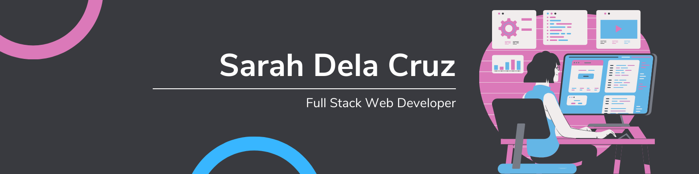

# Hello and welcome!

My name is **Sarah Dela Cruz** and I'm a full stack web developer.

**Pronouns**: She/Her

## About Me
- 🌱 I’m currently learning **TypeScript and Redux**
- ✨ I'm passionate about **accessibility and ease of use**

## Current Projects
- [Portfolio](https://sarahdeecee.github.io/profile/)
  - Personal portfolio and profile page
- [karaoke-saver](https://github.com/MSoup/karaoke-helper)
  - A web app that lets you save song lists you want to sing
- [lechon-tracker](https://github.com/sarahdeecee/lechon-tracker)
  - A customized tracker for organizing production schedules and calculating product costs

## Stack
**Languages:**

**Frameworks:**

**Databases:**

## Certifications
- **Lighthouse Labs:** Diploma of Web Development
- **freeCodeCamp:** [JavaScript Algorithms and Data Structures](https://www.freecodecamp.org/certification/sdc/javascript-algorithms-and-data-structures)
- **freeCodeCamp:** [Responsive Web Design](https://www.freecodecamp.org/certification/sdc/responsive-web-design)
- Japanese Language Proficiency Test (JLPT) N1
- JET Programme Translation and Interpretation Course