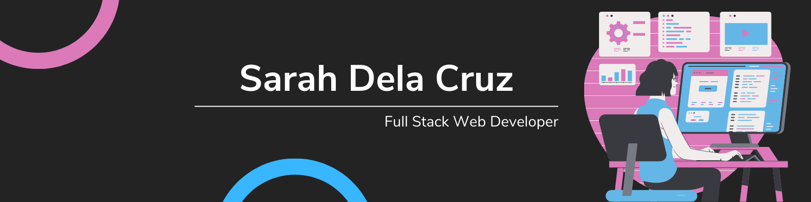

# Hello and welcome!

My name is **Sarah Dela Cruz** and I'm a full stack web developer. 
**Pronouns**: She/Her

## About Me
- 🌱 I’m currently learning **TypeScript and Vue**
- ✨ I'm passionate about **accessibility and ease of use**

## Current Projects
- [karaoke-saver](https://github.com/MSoup/karaoke-helper)
  - A web app that lets you save song lists you want to sing
- [junior](https://github.com/Alex-Reyne/junior)
  - A web app for new developers to create a portfolio with projects
- [lechon-tracker](https://github.com/sarahdeecee/lechon-tracker)
  - A customized tracker for organizing production schedules and calculating product costs

## Stack
**Languages:**
- JavaScript
- Ruby
- HTML
- CSS
- SQL

**Frameworks:**
- Node
- Express
- React
- Rails

**Libraries:**
- React
- jQuery

## Certifications
- Diploma of Web Development (Lighthouse Labs)
- Japanese Language Proficiency Test (JLPT) N1
- JET Programme Translation and Interpretation Course

